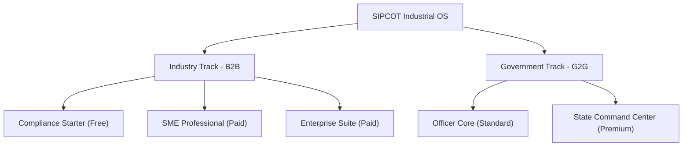
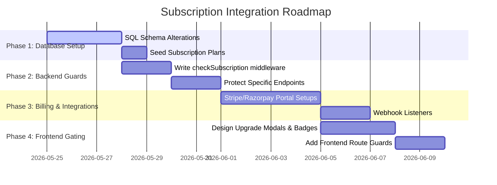

# 🎫 SIPCOT Industrial OS: Subscription Gating & Monetization Blueprint

This document outlines the strategic, architectural, and code-level plan to transition the **SIPCOT Industrial Operating System (Thozhirporul)** from a flat role-based access control (RBAC) model into a tiered **Subscription-as-a-Service (SaaS)** and **Government-Platform-as-a-Service (GlaaS)** model. 

---

## 🗺️ 1. Conceptual Framework & Subscription Strategy

To successfully monetize and manage resources on the platform, we categorize the user base into two parallel tracks: the **Industry Track** (B2B SaaS for factory owners and conglomerates) and the **Government/Admin Track** (G2G/GlaaS for parks managers, department officers, and policymakers).



### 🏢 1.1 Industry Track (B2B SaaS)
Designed for manufacturing units, factories, and corporate offices operating within SIPCOT parks.

*   **Compliance Starter (Free / Tier 1):** Covers baseline regulatory requirements. Ensures all MSMEs and small businesses can perform mandatory legal duties without barrier.
*   **SME Professional (Growth / Tier 2):** Tailored for mid-sized operations looking to optimize resource efficiency, automate report preparation, and track service timelines actively.
*   **Enterprise Suite (Custom Enterprise / Tier 3):** Engineered for conglomerates and large multi-facility manufacturing complexes needing predictive analytics, API automation, and automated mitigation.

### 🏛️ 1.2 Government/Admin Track (G2G GlaaS)
Designed for internal governance, structured as internal cost centers or district-wise budget allocations.

*   **Officer Core (Standard G1):** Operations-level clearance for field inspectors and park managers to process daily workflows.
*   **State Command Center (Premium G2):** High-level strategic intelligence for cabinet ministers, directors, and state-level policy planners.

---

## 📊 2. Subscription Feature Mapping Matrix

Here is the exact mapping of the features from the PRD and Technical Blueprint into subscription tiers:

| Module / Feature | Compliance Starter (Free) | SME Professional (Paid) | Enterprise Suite (Paid) | Officer Core (G1) | State Command (G2) |
| :--- | :---: | :---: | :---: | :---: | :---: |
| **Unified Data Submission** | Basic Forms | Excel Upload | API & ERP Integration | - | - |
| **Compliance Score Dashboard** | Overall Score | Category Breakdown | AI Mitigation Tips | - | - |
| **Services & NOC Tracker** | Standard Pipeline | Kanban + Overdue Alerts | Priority Processing | Handle Tasks | State Bottleneck KPIs |
| **Smart Alerts & Notifications** | Email only | SMS + Slack Webhooks | Escalation Matrices | Task Assigned | System Diagnostics |
| **Analytics & Benchmarking** | Static Park Map | Industry Benchmarks | Predictive Analytics | Park Analytics | Heatmaps & CapEx Trends |
| **Automated Reporting** | - | PDF & Excel Exports | Scheduled Auto-reports | Download Individual | Bulk State Exports |
| **AI Decision Support System** | - | - | - | Basic Recommendations | Deep Policy Scenarios |
| **Workflow Automation Engine** | - | - | Auto-reconciliation | Rule execution | Custom Rule Designer |
| **Audit Trail & Activity Logs** | - | Own logs (14 days) | Own logs (Indefinite) | - | Comprehensive Logs |
| **Mobile Inspection Module** | - | - | - | Field App Sync | Drone & IoT Ingestion |
| **Document Vault** | Up to 10MB | Up to 1GB + Expiry alerts | Unlimited + Auto OCR | View documents | Security Auditing |

---

## 🗄️ 3. Database Schema Extensions (SQL Migration)

To support subscription-based gating, we extend the database schema with a subscription tracking engine. This integrates with PostgreSQL and handles billing cycles, plan statuses, and tier thresholds.

```sql
-- ============================================================
-- SUBSCRIPTION TIERS SCHEMA
-- ============================================================

CREATE TYPE subscription_tier_name AS ENUM ('free_starter', 'sme_pro', 'enterprise_suite');
CREATE TYPE subscription_status AS ENUM ('active', 'past_due', 'canceled', 'trialing');

-- Subscription Plan Catalog
CREATE TABLE subscription_plans (
    id SERIAL PRIMARY KEY,
    tier subscription_tier_name UNIQUE NOT NULL,
    display_name VARCHAR(100) NOT NULL,
    monthly_price_inr DECIMAL(12,2) NOT NULL DEFAULT 0.00,
    annual_price_inr DECIMAL(12,2) NOT NULL DEFAULT 0.00,
    max_document_storage_mb INTEGER NOT NULL DEFAULT 10,
    api_call_limit_per_month INTEGER, -- NULL for unlimited
    has_predictive_analytics BOOLEAN DEFAULT FALSE,
    has_scheduled_reports BOOLEAN DEFAULT FALSE,
    created_at TIMESTAMP DEFAULT CURRENT_TIMESTAMP
);

-- Associate Industry Profiles with Subscriptions
CREATE TABLE industry_subscriptions (
    id SERIAL PRIMARY KEY,
    industry_id INTEGER UNIQUE REFERENCES industry_profiles(id) ON DELETE CASCADE,
    plan_id INTEGER REFERENCES subscription_plans(id),
    status subscription_status DEFAULT 'active',
    current_period_start TIMESTAMP NOT NULL DEFAULT CURRENT_TIMESTAMP,
    current_period_end TIMESTAMP NOT NULL,
    cancel_at_period_end BOOLEAN DEFAULT FALSE,
    stripe_subscription_id VARCHAR(255), -- If integrating Stripe/Razorpay
    billing_email VARCHAR(255),
    created_at TIMESTAMP DEFAULT CURRENT_TIMESTAMP,
    updated_at TIMESTAMP DEFAULT CURRENT_TIMESTAMP
);

-- Seed Initial Plan Information
INSERT INTO subscription_plans (tier, display_name, monthly_price_inr, annual_price_inr, max_document_storage_mb, api_call_limit_per_month, has_predictive_analytics, has_scheduled_reports) VALUES
('free_starter', 'Compliance Starter', 0.00, 0.00, 10, 0, FALSE, FALSE),
('sme_pro', 'SME Professional', 4999.00, 47999.00, 1024, 1000, FALSE, TRUE),
('enterprise_suite', 'Enterprise Suite', 24999.00, 239999.00, 102400, NULL, TRUE, TRUE);

-- Create performance indexes for lookup speeds
CREATE INDEX idx_industry_subscriptions_industry ON industry_subscriptions(industry_id);
CREATE INDEX idx_industry_subscriptions_status ON industry_subscriptions(status);
```

---

## 🛠️ 4. Backend Implementation (Express Middleware & API Gating)

To protect features from unauthorized tiers, we enforce a flexible middleware in Express.js.

### 🛡️ 4.1 Subscription Verification Middleware
```javascript
// backend/src/middleware/subscriptionGuard.js
const db = require('../config/db'); // pg connection pool

/**
 * Middleware to gate API endpoints by subscription tier.
 * @param {Array<string>} allowedTiers - Tiers allowed to access this route
 */
const requireSubscriptionTier = (allowedTiers) => {
  return async (req, res, next) => {
    try {
      // 1. Ensure user is authenticated
      if (!req.user || !req.user.id) {
        return res.status(401).json({ error: 'Authentication required' });
      }

      // 2. Government officers and admins bypass the industry subscription gates
      if (req.user.role === 'admin' || req.user.role === 'govt') {
        return next();
      }

      // 3. Fetch industry subscription status
      const query = `
        SELECT sp.tier, isub.status, isub.current_period_end
        FROM industry_subscriptions isub
        JOIN subscription_plans sp ON isub.plan_id = sp.id
        JOIN industry_profiles ip ON ip.id = isub.industry_id
        WHERE ip.user_id = $1
      `;
      const result = await db.query(query, [req.user.id]);

      if (result.rows.length === 0) {
        // Fallback: Check if they are auto-assigned a free tier
        return res.status(403).json({ 
          error: 'Subscription profile missing',
          code: 'SUBSCRIPTION_REQUIRED'
        });
      }

      const { tier, status, current_period_end } = result.rows[0];

      // 4. Validate subscription status
      if (status !== 'active' && status !== 'trialing') {
        return res.status(403).json({
          error: 'Your subscription is currently inactive or past due. Please update billing details.',
          code: 'BILLING_FAILED'
        });
      }

      if (new Date(current_period_end) < new Date()) {
        return res.status(403).json({
          error: 'Your subscription plan has expired.',
          code: 'SUBSCRIPTION_EXPIRED'
        });
      }

      // 5. Evaluate if current tier has permission
      if (!allowedTiers.includes(tier)) {
        return res.status(403).json({
          error: 'This feature is not available in your current subscription tier.',
          code: 'UPGRADE_REQUIRED',
          requiredTiers: allowedTiers,
          currentTier: tier
        });
      }

      // 6. Inject subscription metadata for controller usage
      req.subscription = { tier, status };
      next();
    } catch (error) {
      console.error('Subscription gating error:', error);
      return res.status(500).json({ error: 'Internal subscription check failed' });
    }
  };
};

module.exports = requireSubscriptionTier;
```

### 🚦 4.2 Endpoint Router Protection Example
```javascript
// backend/src/routes/analytics.js
const express = require('express');
const router = express.Router();
const auth = require('../middleware/auth');
const subscriptionGuard = require('../middleware/subscriptionGuard');
const analyticsController = require('../controllers/analyticsController');

// Standard analytics available to SME Pro and Enterprise Suite
router.get(
  '/benchmarking',
  auth,
  subscriptionGuard(['sme_pro', 'enterprise_suite']),
  analyticsController.getBenchmarkingData
);

// Advanced Predictive Modeling ONLY available to Enterprise Suite
router.get(
  '/predictions',
  auth,
  subscriptionGuard(['enterprise_suite']),
  analyticsController.getPredictiveModels
);

module.exports = router;
```

---

## 🎨 5. Frontend Integration (UI Route Guards & Premium Badging)

A premium user interface indicates feature limitations clearly, using smooth transitions, badge triggers, and intuitive upgrades instead of jarring "Access Denied" screens.

### 🧩 5.1 Gated Feature Wrapper (React Component)
Use this component in the frontend to wrap high-tier dashboards or inputs dynamically.

```jsx
// frontend/src/components/GatedFeature.jsx
import React from 'react';
import { useAuth } from '../context/AuthContext';
import { Button } from '@mui/material';
import LockOutlinedIcon from '@mui/icons-material/LockOutlined';
import SparklesIcon from '@mui/icons-material/AutoAwesome';

export const GatedFeature = ({ children, requiredTiers, fallbackUI }) => {
  const { currentSubscription, user } = useAuth(); // Custom hook pulling current session info

  // Bypass gates for internal Government/Admin roles
  const hasAccess = 
    user?.role === 'admin' || 
    user?.role === 'govt' || 
    requiredTiers.includes(currentSubscription?.tier);

  if (hasAccess) {
    return <>{children}</>;
  }

  // Provide a premium upgrade card if access is restricted
  if (fallbackUI) return fallbackUI;

  return (
    <div className="relative overflow-hidden rounded-2xl border border-slate-800 bg-gradient-to-br from-slate-950 to-slate-900 p-8 text-center shadow-2xl">
      {/* Dynamic Background Blur Glow */}
      <div className="absolute -top-24 -left-24 h-48 w-48 rounded-full bg-violet-600/10 blur-3xl"></div>
      <div className="absolute -bottom-24 -right-24 h-48 w-48 rounded-full bg-cyan-600/10 blur-3xl"></div>

      <div className="relative z-10 flex flex-col items-center max-w-md mx-auto">
        <div className="flex h-14 w-14 items-center justify-center rounded-full bg-violet-500/10 text-violet-400 mb-4 ring-1 ring-violet-500/20">
          <LockOutlinedIcon className="text-2xl" />
        </div>
        
        <h3 className="text-xl font-bold tracking-tight text-white mb-2">
          Unlock Premium Intelligence
        </h3>
        <p className="text-sm text-slate-400 mb-6 leading-relaxed">
          Predictive Analytics, customized report schedulers, and automatic validation checking are exclusive to our higher-tier workspaces.
        </p>

        <div className="flex flex-col sm:flex-row gap-3 w-full justify-center">
          <Button 
            variant="contained" 
            color="primary"
            startIcon={<SparklesIcon />}
            className="bg-gradient-to-r from-violet-600 to-indigo-600 hover:from-violet-700 hover:to-indigo-700 text-white font-medium capitalize py-2 px-6 rounded-lg transition-all shadow-lg shadow-indigo-600/25"
            onClick={() => window.location.href = '/workspace/billing'}
          >
            Upgrade Workspace
          </Button>
          <Button 
            variant="outlined" 
            className="border-slate-800 text-slate-300 hover:bg-slate-900 hover:border-slate-700 capitalize py-2 px-6 rounded-lg transition-all"
            onClick={() => window.location.href = '/features'}
          >
            Learn More
          </Button>
        </div>
      </div>
    </div>
  );
};
```

### 📟 5.2 Dynamic Upgrade Modal (Aesthetic Design Preview)

```jsx
// Gated view rendering preview mockup
<GatedFeature 
  requiredTiers={['enterprise_suite']}
  fallbackUI={
    <div className="glassmorphism-card border border-rose-500/25 p-6 rounded-xl text-center bg-black/40">
      <h4 className="text-rose-400 font-bold text-lg mb-2">Enterprise Module Locked</h4>
      <p className="text-slate-300 text-sm mb-4">Your factory is currently on the Pro Tier. Deep predictive forecasting requires upgrading to Enterprise.</p>
      <button className="upgrade-btn bg-rose-600 hover:bg-rose-500 text-white font-semibold py-2 px-5 rounded-lg text-sm shadow-md transition-all">
        Consult Enterprise Pricing
      </button>
    </div>
  }
>
  <PredictiveModelingDashboard />
</GatedFeature>
```

---

## 🏁 6. Step-by-Step Implementation Roadmap

Implementing this transition is organized into four logical phases:



1.  **Phase 1 (Database Migration):** Run the schema migrations, link existing industry users to the default `free_starter` tier, and set active periods.
2.  **Phase 2 (API Gating):** Add the Express subscription checking middleware to target routes, ensuring all data-intensive operations are guarded.
3.  **Phase 3 (Payment Processor Integration):** Connect webhooks from Stripe or Razorpay to listen to events (`invoice.payment_succeeded`, `customer.subscription.deleted`) and update `industry_subscriptions` in real-time.
4.  **Phase 4 (UI Gating & Badges):** Add locked overlays or callout widgets to locked components, and deploy the visual pricing table in user settings for conversion.
